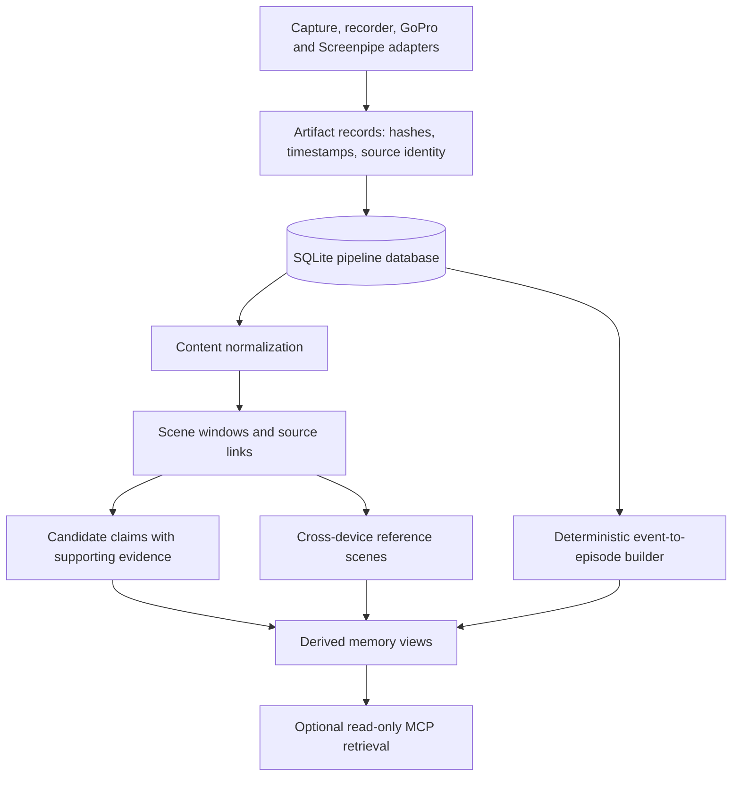

# Guardian Evidence Pipeline

**Normalize multimodal observations into traceable events, scenes, and episodes.**

Built by **Jackie Oliver** at Haptica. I built the ingestion and evidence-processing pipeline: artifact tracking, source prioritization, temporal grouping, cross-device alignment, derived claims, and retrieval surfaces.

**Python · SQLite · provenance links · deterministic episode construction · optional MCP**

This repository contains processing code and fabricated tests. It contains no recordings, transcripts, screenshots, personal memories, voiceprints, or populated databases.

## Architecture



The stages are individual tools, not an automatic end-to-end service. Capture ingestion can queue interpretation jobs; live model workers and private interpretation prompts are excluded. Model-generated events must be supplied separately or replaced with synthetic inputs, as in the tests.

## Read the implementation

| File | Engineering focus |
| --- | --- |
| [Database and records](ops/guardian_pipeline_db.py) | Artifact/job/run/event schema, stable identities, provenance links, and derived objects. |
| [Capture segmentation](ops/guardian_capture_segments.py) | Observation grouping and segment packets. |
| [Source priority](ops/guardian_source_priority.py) | Explicit ordering of direct observations and interpretations. |
| [Recorder ingestion](ops/guardian-pipeline-ingest-recorder.py) | Transcript artifacts, source timing, offsets, and scene windows. |
| [Content normalization](ops/guardian-pipeline-normalize-content.py) | Searchable spans tied to source records. |
| [Scene claims](ops/guardian-pipeline-build-scene-claims.py) | Candidate claims and supporting evidence. |
| [Cross-device alignment](ops/guardian-pipeline-align-cross-device.py) | Reference scenes connecting multiple device streams. |
| [Episode builder](ops/guardian-pipeline-build-episodes.py) | Temporal grouping, gaps, interruptions, and links back to events. |
| [Memory builder](ops/guardian-memory-build.py) and [MCP server](ops/guardian_mcp_server.py) | Retrieval/read views over prepared databases. |

## Engineering logic

- **Evidence and interpretation stay separate.** Artifacts retain identity, hashes, clocks, and source metadata; derived claims link back to support.
- **Sources have an explicit priority policy.** Direct application metadata ranks above OCR, ambient/camera signals, and model interpretation. This is a heuristic policy, not a calibrated truth probability.
- **Clock quality is represented.** Wall time, monotonic timing, offsets, and confidence are stored separately so alignment does not silently assume synchronized devices.
- **Rebuild derived views.** Episodes are regenerated for a selected user/day, with stable results and explicit event links.
- **Limit retrieval authority.** The MCP layer is designed to read prepared context. It is separate from acquisition and processing.

## Run a synthetic example

Python 3.11+ is sufficient for the core test; no network, models, accounts, or media are needed:

```sh
python3 -m unittest discover -s tests -v
python3 ops/guardian-pipeline-build-episodes.py --help
```

**Two tests passed on October 6, 2026.** The end-to-end test inserts two fabricated events, builds an episode, verifies its source links, rebuilds it, and confirms that the result and link count remain stable. The second checks that direct observations outrank model interpretation.

Optional image handling uses Pillow. The MCP server requires the Python `mcp` package and your own prepared databases/context documents; no personal bootstrap documents are distributed here.

## Limits

The repository preserves research-stage processing logic. It does not establish recognition accuracy or validate inferred identity/biographical claims. Some day-boundary helpers use a fixed UTC-7 offset, so year-round timezone/DST correctness is not claimed. Live media adapters, model inference, and MCP serving were not exercised in this publication pass.

See [publication scope](PUBLICATION.md) for the clean-edition boundary.
